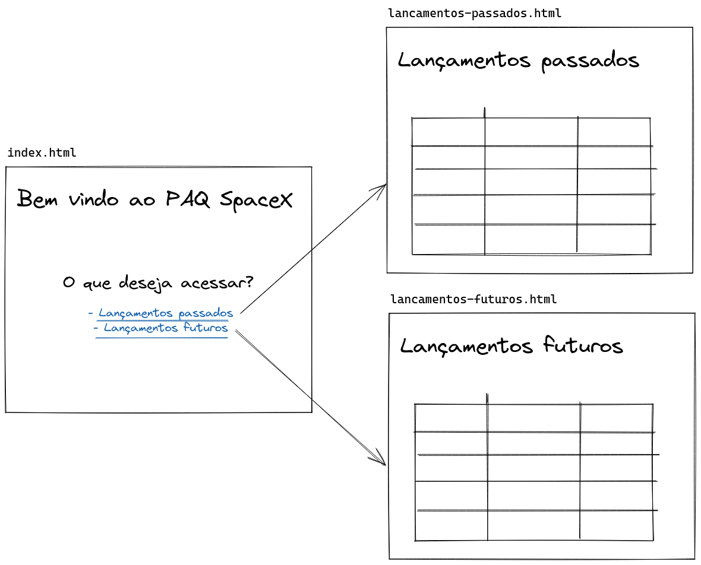

# PAQ SpaceX

O objetivo deste projeto é buscar dados de lançamentos de foguetes pela API da SpaceX. Para isto vamos implementar as seguintes funcionalidades:

- Listar lançamentos de foguete passados a partir [deste endpoint](https://api.spacexdata.com/v5/launches/past);
- Listar lançamentos de foguete futuros a partir [deste endpoint](https://api.spacexdata.com/v5/launches/upcoming);

## Estrutura de páginas do projeto

Para a navegação usaremos uma estrutura com 3 páginas:

- **Indice**: terá o link para as páginas de lançamentos passados e futuros
- **Lançamentos passados**: vamos listar os lançamentos de foguete que já aconteceram
- **Lançamentos futuros**: vamos listar os lançamentos de foquete que ainda irão acontecer

## Material de apoio

- [Como consumir uma API em Javascript (Youtube)](https://www.youtube.com/watch?v=IDG6EOXYAq8)
- [O que é JSON](https://www.hostinger.com.br/tutoriais/o-que-e-json)

## Sugestão de estrutura de código

```
/paginas
	index.html
	lancamentos-passados.html
	lancamentos-futuros.html
```

## Sugestão de como ficariam as páginas




